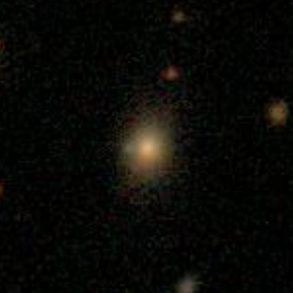
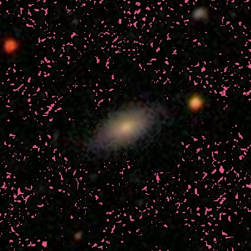
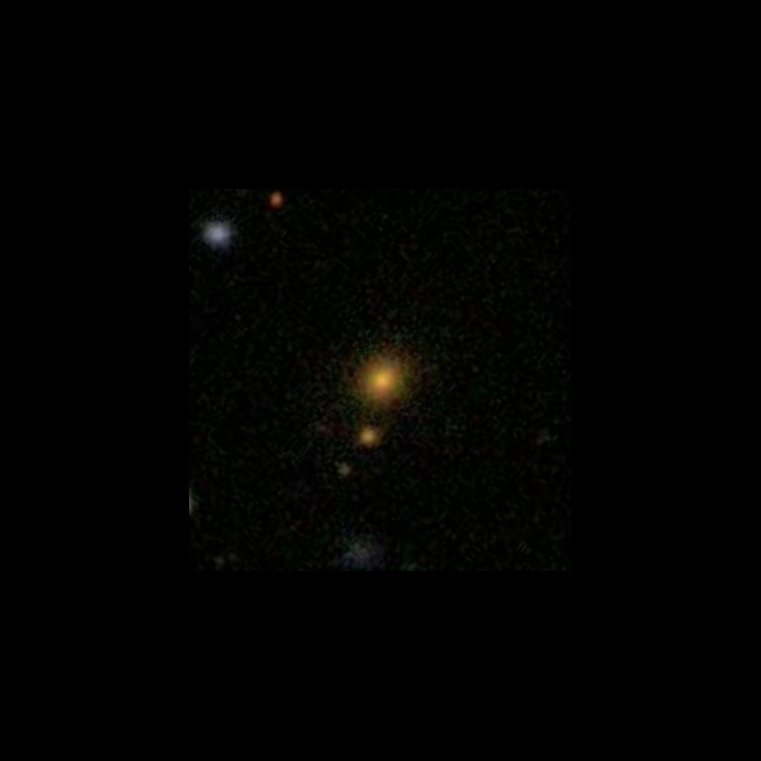
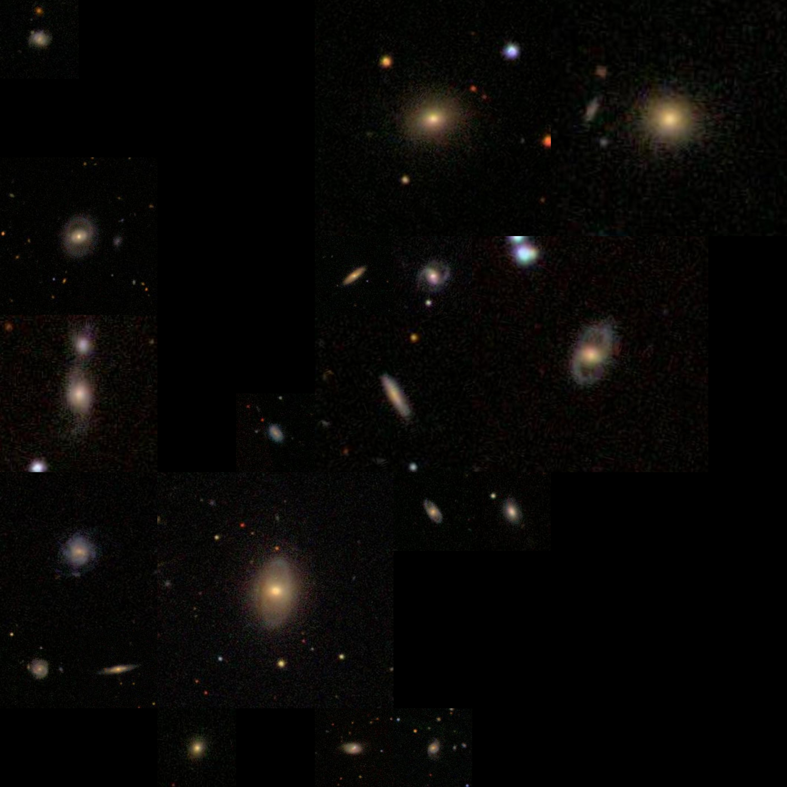
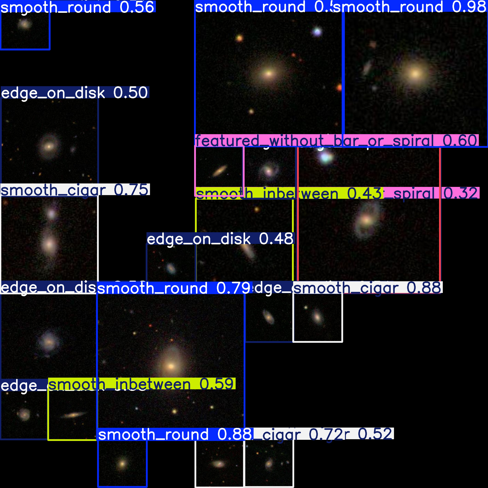

# Overview
An application that uses the Ultralytics YOLO model to segment and identify galaxy types, trained on augmented data from the Galaxy Zoo project.

***What this project does***

- Downloads and uses the data from https://github.com/mwalmsley/galaxy-datasets?tab=readme-ov-file, extracting labels and converting them into YOLO format
- Augments images from the Galaxy Zoo project to create artificial noise, discourage overfitting, and imitate usage scenarios.
- Utilizing Kivy to create an interactive front end that lets users select input images and save augmented photos.

***Getting Started***

***Requirements***
- Python 3.11.9

***Running Locally***
```
   git clone https://github.com/cxwang1037738928/Galaxy-Identifier.git
   cd Project
   python main.py
```

***Examples of augmented photos***

***What a photo from the galaxy zoo dataset look like***



***Modifed image with artificial noise***



***Modified image with padding to implement dynamic box to image size ratio***



***Stitched canvas composing of various images of modifed proportions***



***Result on a validation image***



***WIP***
- Implementing dockerfile


